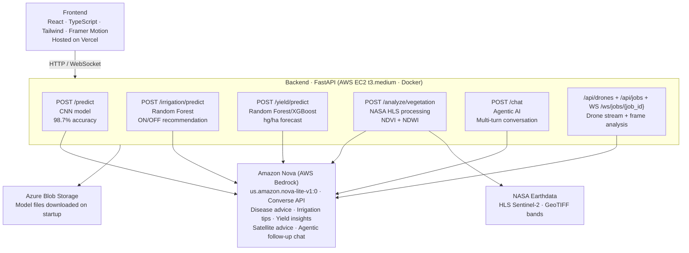

# 🌱 AgriSense AI — Precision Agriculture Powered by Amazon Nova

> AI-powered crop disease detection, satellite farm monitoring, and smart irrigation for African smallholder farmers — all explained by Amazon Nova in plain language they can act on.

**Live Demo:** [agrisense-ai-nova.vercel.app](https://agrisense-ai-nova.vercel.app)  
**Backend API:** [http://3.228.16.29:8080/docs](http://3.228.16.29:8080/docs)  
**Demo Video:** [YouTube](https://youtu.be/O-JkRP0YPoM)

---

## 🏗️ Architecture



---

## 🛰️ The Four-Layer Intelligence Stack

| Layer | Source | Technology | Nova Role |
|-------|--------|-----------|-----------|
| 🛰️ **Satellite** | Farm-level | NASA HLS Sentinel-2, rasterio, NDVI/NDWI | Interprets drought risk & vegetation health |
| 🚁 **Drone** | Field-level | RTSP/RTMP streams, FFmpeg, WebSocket | Advises on frame-by-frame disease detections |
| 📷 **Camera** | Plant-level | CNN (TensorFlow/Keras), PlantVillage dataset | Generates treatment plans with urgency levels |
| 💧 **Sensors** | Soil-level | Random Forest, IoT/MQTT, real-time dashboard | Explains irrigation & yield predictions |

---

## 📁 Project Structure

```
agrisense-ai-nova/
├── .github/
│   └── workflows/
│       └── deploy.yml              # GitHub Actions → EC2 auto-deploy
│
├── backend/                        # FastAPI application
│   ├── Dockerfile                  # Docker container config
│   ├── requirements.txt            # Python dependencies
│   ├── app/
│   │   ├── main.py                 # FastAPI entry point
│   │   ├── core/
│   │   │   ├── ml.py               # Model loading (CNN, RF, encoders)
│   │   │   └── state.py            # In-memory drone/job state
│   │   ├── routers/
│   │   │   ├── predict.py          # POST /predict
│   │   │   ├── irrigation.py       # POST /irrigation/predict
│   │   │   ├── yield_api.py        # POST /yield/predict
│   │   │   ├── satellite.py        # POST /analyze/vegetation
│   │   │   ├── chat.py             # POST /chat
│   │   │   ├── drones.py           # POST /api/drones + WebSocket
│   │   │   └── health.py           # GET /health
│   │   ├── schemas/
│   │   │   └── requests.py         # Pydantic request models
│   │   ├── services/
│   │   │   └── nova_client.py      # Amazon Nova via AWS Bedrock
│   │   └── satellite/
│   │       ├── analysis_engine.py  # NDVI/NDWI computation
│   │       └── nasa_client.py      # NASA earthaccess integration
│   ├── data/
│   │   ├── class_indices.json      # CNN label mappings
│   │   └── disease_info.json       # Disease metadata
│   └── models/                     # ML model files (auto-downloaded)
│
└── frontend/                       # React application
    └── src/
        ├── components/
        │   ├── homepage/           # Landing page sections
        │   ├── Pages/
        │   │   ├── Workspace/      # AI analysis workspace
        │   │   ├── Dashboard/      # IoT sensor monitoring
        │   │   ├── FarmAssistant/  # Free-form Nova chat
        │   │   ├── FarmManagement/ # Quick access hub
        │   │   └── Settings/
        │   ├── Map/                # Farm boundary drawing
        │   └── common/             # Shared components
        ├── hooks/                  # useCamera, useDrone, useSensors
        ├── services/api/           # Backend API calls
        └── utils/                  # Constants and helpers
```

---

## 🚀 Local Setup

### Prerequisites
- Python 3.11+
- Node.js 18+
- AWS account with Bedrock access
- NASA Earthdata account (free at [urs.earthdata.nasa.gov](https://urs.earthdata.nasa.gov))

### Backend

```bash
cd backend
python -m venv venv
source venv/bin/activate
pip install -r requirements.txt
```

Create `backend/.env`:
```env
# AWS Bedrock (Amazon Nova)
AWS_ACCESS_KEY_ID=your_key
AWS_SECRET_ACCESS_KEY=your_secret
AWS_REGION=us-east-1
NOVA_MODEL_ID=us.amazon.nova-lite-v1:0

# NASA Earthdata
EARTHDATA_USERNAME=your_username
EARTHDATA_PASSWORD=your_password

# Azure Blob Storage (ML models)
CNN_AZURE_URL=https://...
YIELD_AZURE_URL=https://...
IRRIGATION_AZURE_URL=https://...
LABEL_ENCODER_AZURE_URL=https://...
```

```bash
uvicorn app.main:app --reload --port 8000
```

Docs at: [http://localhost:8000/docs](http://localhost:8000/docs)

### Frontend

```bash
cd frontend
npm install
```

Create `frontend/.env`:
```env
REACT_APP_BACKEND_URL=http://localhost:8000
REACT_APP_API_URL=http://localhost:8000
REACT_APP_WS_BASE_URL=ws://localhost:8000
```

```bash
npm start
```

---

## 🔌 API Endpoints

| Method | Endpoint | Description |
|--------|----------|-------------|
| `GET` | `/health` | Health check, model status |
| `POST` | `/predict` | CNN crop disease detection |
| `POST` | `/irrigation/predict` | Irrigation ON/OFF recommendation |
| `POST` | `/yield/predict` | Crop yield forecast |
| `POST` | `/analyze/vegetation` | NASA satellite NDVI/NDWI analysis |
| `POST` | `/chat` | Agentic multi-turn Nova conversation |
| `POST` | `/api/drones/connect` | Connect RTSP/RTMP drone |
| `POST` | `/api/jobs` | Start drone frame analysis |
| `WS` | `/ws/jobs/{job_id}` | Real-time drone results |

---

## 🐳 Docker

```bash
cd backend
docker build -t agrisense-backend .
docker run -d --name agrisense-api -p 8080:8080 --env-file .env agrisense-backend
```

---

## ⚙️ CI/CD

Every push to `main` that modifies `backend/**` automatically deploys to EC2 via GitHub Actions — pulls code, rebuilds Docker image, restarts container.

---

## 🧠 AI Models

| Model | Type | Training Data | Performance |
|-------|------|--------------|-------------|
| Pest Detection CNN | TensorFlow/Keras | 50,000 PlantVillage images | 98.7% accuracy |
| Smart Irrigation RF | Random Forest | Soil/weather sensor data | 89.5% confidence |
| Yield Prediction | XGBoost | FAO crop yield dataset | 0.63 R² score |

Models auto-download from Azure Blob Storage on first startup.

---

## 🌍 Impact

Targeting **500 million smallholder farmers in Africa** who lose up to 40% of crops to undetected diseases with no access to agricultural experts. **150+ beta users** across Nigeria.

---

## 🛠️ Tech Stack

**Backend:** Python, FastAPI, TensorFlow, scikit-learn, XGBoost, NASA earthaccess, rasterio, boto3  
**Frontend:** React, TypeScript, Tailwind CSS, Framer Motion  
**AI:** Amazon Nova Lite via AWS Bedrock  
**Infrastructure:** AWS EC2, Docker, GitHub Actions, Vercel  

---

## 📄 License

MIT — Built for the **Amazon Nova AI Hackathon 2026** by [Joshua Okoghie](https://github.com/Bigdreams415)